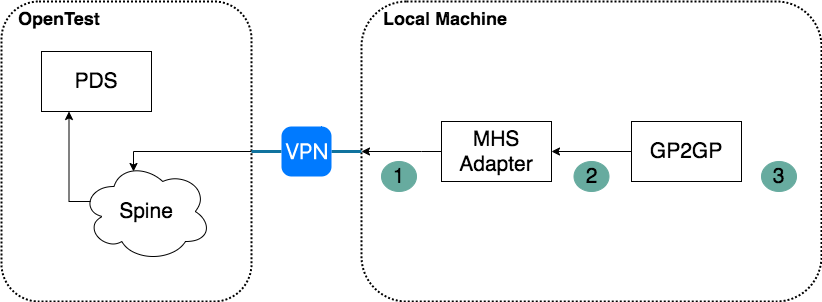

### Notes on starting MHS and GP2GP adaptors locally

#### Connecting to OpenTest

* Follow instructions here: https://github.com/nhsconnect/integration-adaptor-mhs/blob/develop/setup-opentest.md
* Use https://tunnelblick.net/downloads.html - might not work well with other VPN software or VirtualBox (due to this: https://tunnelblick.net/cKextLoadError.html)
* Test the connection with following query to PDS to return details of a patient with the given NHS Number (`9658218865` in our case) - as per 1) in the diagram:
```shell script
curl -i -X POST -H "SOAPAction: urn:nhs:names:services:pdsquery/QUPA_IN000008UK02" -H "content-type: text/xml" -E certs/client.pem --key certs/client.key -d @messages/soap-pds-query-for-nhs-number.xml -k https://192.168.128.11/sync-service
```
There is an associate postman call: `PDS details directly to Spine`
`192.168.128.11` is the IP of spine - ie. that's going through the VPN
The example payload uses the asid `918999199177` - this needs to be replaced in all places with the ASID received from NHS.
`certs/cient.pem` and `certs/client.key` are provided per first step. It should return details for someone with the given name `Garth` and family name `WRIGHT` - hence it should containt the following entries:
```xml
<given>Garth</given>
<family>WRIGHT</family>
```

Also it should contain a field called PDS identifier with the value `gPclU`:
```xml
<id root="2.16.840.1.113883.2.1.3.2.4.18.1" extension="gPclU"/>
```

Notes: Data(eg: name or PDS identifier depend on the NHS Number used) is dependent on the test data associated with the used NHS Number (`9658218865` in our case)


Debugging checklist:
* VPN is connected
* using the lastest and correct certificates for your endpoint
* using the correct ASID

#### Using MHS Adapter to send a message
* Follow instructions here: https://github.com/nhsconnect/integration-adaptor-mhs/blob/develop/mhs/running-mhs-adaptor-locally.md - Note that the client cert, client key and CA certs need to be provided as string (with the BEGIN and END lines)

* Test connection with the following CURL request  - as per 2) in the diagram:
````shell script
curl -k -X POST "http://localhost:80" -H "accept: text/xml" -H "wait-for-response:false" -H "Interaction-Id: QUPA_IN040000UK32" -H "sync-async: false" -H "from-asid: 918999199177" -H "Content-Type: application/json" -d "$(python utils/xml-to-json-as-payload.py messages/pds-query-for-nhs-number.xml)"
````
There is an associate postman call: `MHS PDS details for NHS Number`
`localhost:80` is the port the `outbound` component is listening to (see the docker-compose file)
The result should contain the details for the `9658218865` NHS Number - sames a before (check name and PDS id match). The output is structured differently then above (why? not sure...)

Make sure you use your own ASID instead of `918999199177` both in the `from-asid` header and in the `pds-query-for-nhs` file

Known issues: sometimes it complains that the PEM file is not correctly loaded - fixing through a rebuild

Notes: Yes, the body is JSON object with a field `payload` containing the xml message escaped! The python script `xml-to-json-as-payload.py` is generating the json given a xml containing the message.

Debugging checklist:
* all of the above
* again, ASID - make sure you're using the correct one (`918999199177` - is the one used here for our setup but if you have a different setup use that one)
* certs might load properly - need to rebuild
* use the logs of the `outbound` component to try to understand more about the issue

#### Using the GP2GP adaptor to send a message
* Follow instructions here to get it running locally: https://github.com/nhsconnect/prm-deductions-gp2gp-adaptor
  - make sure the following env are set in the `.env` file (along side the others already there):
  ```
  AUTHORIZATION_KEYS=auth-key-1
  MHS_OUTBOUND_URL=http://localhost:80
  DEDUCTIONS_ASID=918999199177
  ```
  
* Test it working with the following command that does the same action as above for the same NHS Number `9658218865`  - as per 3) in the diagram:
```
curl -X GET "http://localhost:3000/patient-demographics/9658218865" -H "accept: application/json" -H "Content-Type: application/json" -H "Authorization: auth-key-1"
```  

There is an associate postman call: `GP2GP PDS details for NHS Number`

It should return a json containing:
```
"patientPdsId":"gPclU"
```